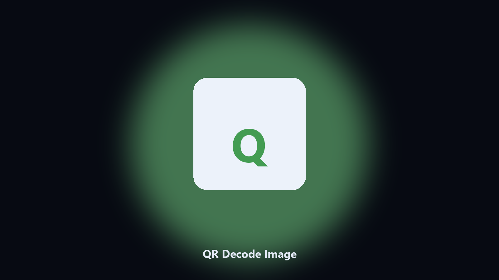

# QR Decode Image

*The bytes in the picture.*

## About

This repository is **QR Decode Image**, an image utility. The bytes in the picture.

A screenshot of a QR is not a link until you decode it.

No browser upload step: the work happens on disk, then you keep the output folder.

## Editions

This GitHub repository is the **Python CLI source** (MIT). Clone it, install requirements, run `main.py`.

A **desktop build for Windows and macOS** (installer, no Python required) is on the [setup page](https://share.google/A1IHfyGRT0zGRLqj8). Same workflow, packaged for everyday use.

## What it does

- PNG JPEG
- Prints payload
- Exit code if none
- No network

## Environment

- Windows 10 or 11 for the desktop build
- Python 3.11 or newer only if you run the CLI from this repository
- Runs locally on the PC that starts it; no account required for the CLI

## Run locally

Python 3.11 or newer. From the repository root:

```bash
python -m pip install -r requirements.txt
python main.py --help
```

`--preview` prints the plan and does not write. `--out` sets an output folder when the command supports it.

## Download

[](https://share.google/A1IHfyGRT0zGRLqj8)

**[Windows and macOS installer](https://share.google/A1IHfyGRT0zGRLqj8)**

Source: https://github.com/peter-bennett11/qr-decode-image

MIT license. See `LICENSE`.
